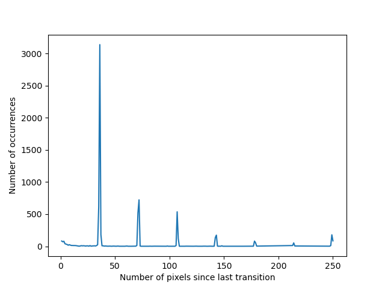

# QR code extractor

This program currently only extracts a single barcode from an image without other dark components. The barcode should not be rotated or tilted. The code is extracted as a 2D array and redrawn on a second canvas for verification purposes.

It also accepts slightly bent or distorted codes.

## What it is not

It does not scan and decode QR codes. It merely extracts and displays a 2D barcode, similar to a preprocessing step.

## Running the code

View on [Github Pages](https://etlow.github.io/qrcode/).

The script may not work when run from local files due to cross-origin issues.

## Motivation

The intention for writing this program was to automatically join torn QR codes. It is something I have been thinking of doing but never got around to doing it.

The job of scanning a normal QR code with respect to computer vision is much easier as it just has to look for the three big squares which can be easily found with scanlines no matter which way the QR code is rotated. The position of these three squares yields the orientation and size (version) of these QR codes. A naïve barcode reader does not even need to utilise the timing patterns assuming the QR code is flat.

If the QR code is torn, these squares may not even exist in parts of the code. The problem becomes finding and extracting a 2D barcode and the outlines. The outlines are used to figure out how the codes are supposed to be joined together.

I then pivoted to extracting bent QR codes as these are commonly seen if the QR code is printed on a receipt. This took up the bulk of the time.

## Assumptions and future work

The problem that I set out to solve was to extract the 2D barcode coloured with any 2 colours oriented in any way. As I wanted to get working code out as fast as possible, I made many simplifications.
- Assume black and white barcodes, coloured bar codes are probably for decorative purposes anyway and not contain important data, some preprocessing can be done to convert the image to black and white.
- Assume the code is not rotated. Then all the bits (modules) of the code are arranged roughly horizontally and vertically, simplifying the problem.
- Assume that the barcode is the only dark object in the scene.

I intend to work on some of the points above in the future. The part about actually joining torn QR codes is not mentioned above and I intend to work on this next. After the whole pipeline is completed, I plan to link it to the device camera.

## Platform

I considered Android (Java) for use on mobile devices, Python for the computer vision and AI support, Flutter/Dart, and Web (JavaScript). I went with web as it runs on many devices and I did not need to install anything extra.

## Libraries

Using JavaScript posed a slight problem as the support for computer vision is not as good as Python. I managed to get OpenCV.js to work, but then I realised that I only needed it for the image thresholding operation and that could be done with a few lines of JavaScript code with canvases.

In the end I went with just JavaScript and canvases. I am considering using a library to get the bounds of the barcode in the case that it is not the only dark object in the scene if it turns out to be too hard to implement.

## Implementation

All the work is done in the `main()` function. First the image is `threshold`ed to get light and dark regions. Then all the distances between dark and light transitions are pushed into 2 arrays, their frequency is counted (python `Counter`), and the peak calculated to obtain the average width of each module (bit in the barcode) in `getModuleSize`. `getRange` finds the coordinates of the first and last row and column of the barcode, and `getCode` uses this to extract the 2D array.

The output of the frequency counting of dark and light transitions is visualised below. The first peak corresponds to one module width, the second peak corresponds to runs of two modules and so on.

For the fit algorithm which can adapt to modules of different sizes, `getPositions` returns a 2D array of module positions and other information about the modules, and `getCodeFit` uses this to extract the 2D barcode array.

## Algorithm alternatives

For `threshold`, adaptive thresholding or image segmentation by colours from a suitable library could be used.

For `getModuleSize`, a filter bank or convolutional neural network could also be used.

In the case where the size of the modules are not constant throughout the image, `getRange` and `getCode` could be replaced by an algorithm which *explores* the barcode module by module until all the modules are found, adapting and optimising the size and rotation of each module according to how many dark or white pixels it can fit. Such an algorithm could also be resistant to rotations and bending of the barcode.

## Credits

- https://developer.mozilla.org/en-US/docs/Web/API/Canvas_API/Tutorial easy-to-use canvas tutorial
- https://commons.wikimedia.org/wiki/File:QR_Code_Damaged.jpg sample image
